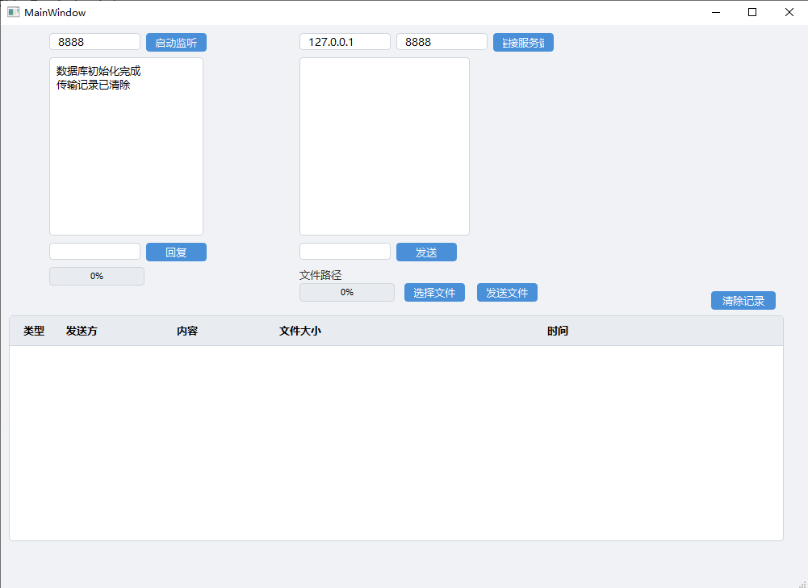
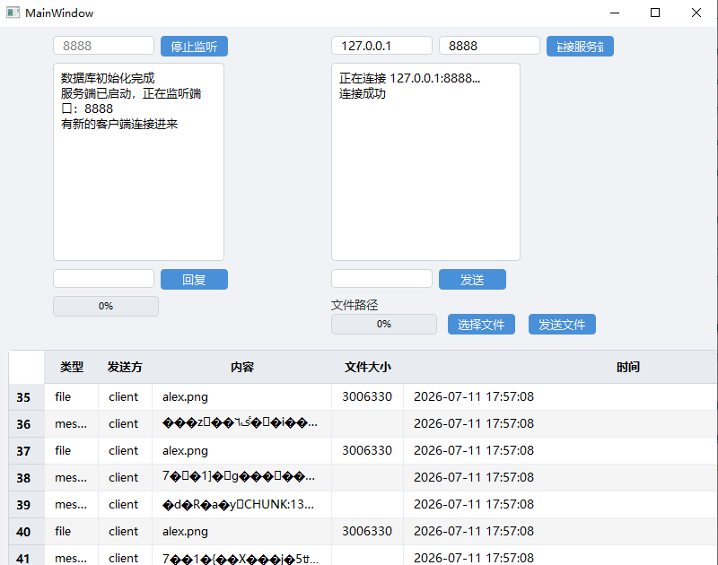

# Qt-LanTransfer

> 基于 Qt6 的局域网文件传输与即时通讯工具，支持 TCP 文本通信、文件分片传输、传输历史记录和多线程并发发送。

## 运行截图

### 当前版本



### 初版对比



## 功能

| 模块 | 功能 | 说明 |
|------|------|------|
| 网络通信 | TCP 双向文本消息 | 客户端连接服务端后，双方可互发文本消息 |
| 文件传输 | 分片传输 + 进度条 | 自定义协议，64KB 分片，支持任意大小文件 |
| 传输历史 | 数据库记录 + 表格展示 | SQLite 存储，QSqlTableModel + QTableView 实时展示 |
| 多线程 | 子线程读取文件 | moveToThread 方式，主线程只写 socket，UI 不卡顿 |
| 界面美化 | QSS 全局样式 | 蓝色系配色，按钮/输入框/进度条/表格统一样式 |
| 数据管理 | 一键清除记录 | 确认对话框防误删，同时清理数据库和接收文件 |

## 技术栈

- **语言**：C++17
- **框架**：Qt 6
- **构建**：qmake
- **数据库**：SQLite（QSqlDatabase + QSqlQuery）
- **网络**：QTcpServer / QTcpSocket（TCP）
- **多线程**：QThread + moveToThread + QMetaObject::invokeMethod
- **UI**：Qt Widgets（QMainWindow、QTableView、QProgressBar、QFileDialog 等）

## 核心架构

```
Qt-LanTransfer/
├── main.cpp              # 入口
├── mainwindow.h / .cpp   # 主窗口（UI + 网络 + 数据库 + 协议解析）
├── mainwindow.ui         # Qt Designer 界面文件
├── filesender.h / .cpp   # 多线程文件发送器
├── transfer.db           # SQLite 数据库（运行时自动生成）
├── screenshot.png        # 运行截图
└── Qt-LanTransfer.pro    # qmake 项目文件
```

### 网络协议

```
FILE:文件名:文件大小:总片数\n
CHUNK:片号\n + 64KB二进制数据
```

### 多线程模型

```
主线程（UI）                         子线程（FileSender）
─────────                          ─────────────
点击"发送文件" → 创建 FileSender
                ↓
        fileSender->start()  ───→  doSend() 读取文件 + 切片
                                      ↓
                                emit headerReady()  ──→ 写 FILE: 头部
                                emit chunkReady()   ──→ 写 CHUNK: 数据
                                emit finished()     ──→ 清理 + 恢复按钮
```

## 编译运行

### 环境要求

- Qt 6.x（含 Widgets、Network、Sql 模块）
- MinGW / MSVC 编译器
- 或直接使用 Qt Creator

### 步骤

```bash
git clone https://github.com/xuchang1025/Qt-LanTransfer.git
cd Qt-LanTransfer
mkdir build && cd build
qmake ..
make          # Linux/macOS
mingw32-make  # Windows MinGW
```

或直接用 Qt Creator 打开 `Qt-LanTransfer.pro`，点击运行。

### 使用方式

1. 服务端：输入端口号 → 点击"启动监听"
2. 客户端：输入 IP 和端口 → 点击"连接服务端"
3. 发送消息：在输入框输入文字 → 点击"发送"
4. 发送文件：点击"选择文件" → 点击"发送文件"
5. 查看记录：窗口底部表格自动展示所有传输历史
6. 清除记录：点击"清除记录"按钮，确认后清空数据库和文件

## Git 提交历史

| 提交 | 内容 |
|------|------|
| `chore: initialize Qt LanTransfer project` | 项目初始化 |
| `feat: add client connect to server` | 客户端连接服务端 |
| `feat: add client send message to server` | 客户端发送文本消息 |
| `feat: add connection status feedback` | 连接状态反馈 |
| `feat: add bidirectional text communication` | 双向文本通信 |
| `feat: add file transfer with simple protocol` | 文件分片传输 |
| `feat: add sqlite transfer history logging` | SQLite 传输日志 |
| `feat: add transfer history, multi-threaded file sending, and QSS styling` | 传输历史、多线程、QSS美化 |

## 后续计划

- [ ] 多客户端同时连接管理
- [ ] UDP 局域网设备自动发现
- [ ] CMake 迁移
- [ ] 打包发布（windeployqt）

---

*Qt 网络编程学习项目 | 求职作品*